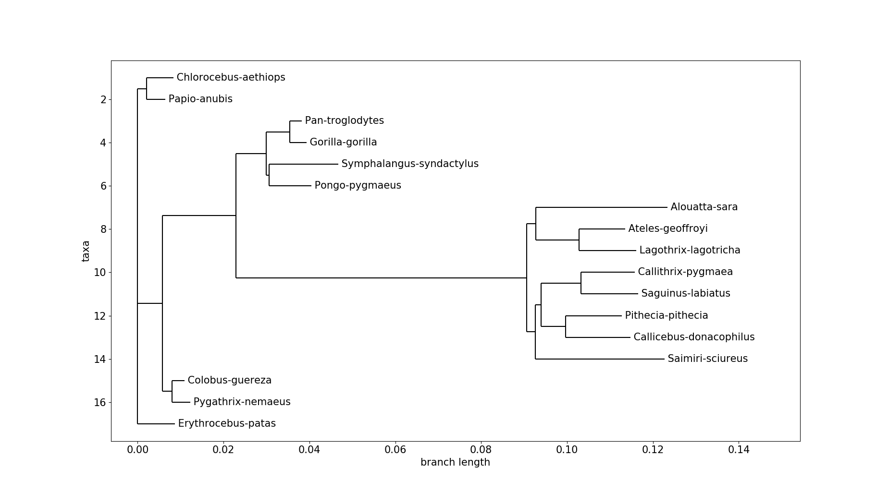

# BioinfoAnalysis

## 1. Introdução

A bioinformática é uma área multdisciplinar que surgiu recentemente motivada pela utilização de ferramentas computacionais para a análise de dados genéticos,
bioquímicos e de biologia molecular. Seu principal objetivo é estudar e desvendar a grande quantidade de dados obtidos a partir de seqüências de DNA usando e desenvolvento novas técnicas computacionais.

### 1.1. Motivação
Durante a realização do Curso de Verão de Bioinformática 2018, na Universidade de São Paulo fui apresentada à área em seus diversos aspectos. Com a popularização, desenvolvimento e refinamento dos métodos de sequenciamento do DNA houve um enorme aumento da quantidade de dados biológicos disponíveis. Inspirados pelo o impacto nas descobertas causado pela utilização de métodos de Data Science nas mais diversas areas, decidimos assim explorar sequencias de DNA de diferentes espécies. 

## 1.2. Objetivo
O objetivo deste projeto é analisar sequencias de genes homólogos para construção de árvores filogenéticas usando a sequências da proteína TRIM5alpha de 17 espécies fazendo proveito de ferramentas de Machine Learning utilizando linguagem Python. 

### 1.3. Dados
Foram utilizados amostras de DNA TRIM5alpha genômico de 17 espécies. O TRIM5alpha é uma proteína fator de restrição de retrovírus que medeia a infecção precoce por bloqueio. 

Nos chamados Macacos do Velho Mundo, Cercopithecidae, o  TRIM5α foi isolado como uma proteína de macaco rhesus responsável por bloquear a infecção pelo HIV-1. Assim estes macacos não podem ser infectados com o HIV-1, o vírus que causa a AIDS em humanos.
A versão humana do TRIM5α não tem como alvo o HIV-1, mas pode inibir as cepas do vírus da leucemia murina (MLV), bem como o vírus da anemia infecciosa eqüina (EIAV).

Segue a lista das 17 espécies estudadas:

* Chlorocebus 
* Papio anubis 
* Pan troglodytes 
* Colobus guereza 
* Pygathrix nemaeus 
* Symphalangus syndactylus 
* Gorilla gorilla 
* Alouatta sara 
* Callithrix pygmaea 
* Pongo pygmaeus 
* Erythrocebus patas 
* Pithecia pithecia 
* Ateles geoffroyi 
* Saimiri sciureus 
* Saguinus labiatus 
* Callicebus donacophilus 
* Lagothrix lagotricha 

Os dados usados foram baixados do NCBI (National Center for Biotechnology Information Search database) e podem ser encontrados neste link: goo.gl/HYqnxD. Foi escolhido o PopSet usado no trabalho "Positive selection of primate TRIM5alpha identifies a critical species-specific retroviral restriction domain." [1] que inseriu no GenBank os 17 arquivos sob os números de acesso AY843504, AY843505, ... até  AY843520.

### 1.4. Pacotes e versões

Para execução do código encontrado neste repositório foram utilizados os seguintes pacotes:
* Biopython 1.7
* Matplotlib 3.0.1
* Numpy 1.15.2
* Pandas 0.23.4
* Pygraphviz 1.5
* CLUSTAL 2.1 Multiple Sequence Alignments

## 2. Relação entre espécies

As espécies são classificadas com base nas suas características compartilhadas. Quanto maior o número de características compartilhadas, maior a probabilidade de que as espécies estejam fortemente relacionadas entre si. As características anatômicas compartilhadas, como a presença de uma coluna vertebral, é um exemplo do que se pode ser utilizado para estudar relações evolutivas. Todavia nem todas as características podem ser facilmente interpretadas.

### 2.1. Relação baseada em sequências moleculares

As sequências moleculares, (DNA, RNA, proteínas) também são usadas para estudar as relações evolutivas. Assim como na comparação anatômica, a comparação de sequências também busca semelhanças e diferenças para deduzir relações. se realizada apropriadamente, esta comparação pode ser mais objetiva e menos ambígua que a comparação anatômica.

### 2.2. Diferenças nas sequências e nas relações evolutivas
Os organismos relacionados evolutivamente possuem um ancestral comum, com uma sequência ancestral de DNA. A medida que os organismos evoluem e divergem, suas sequencias de DNA vão acumulando diferenças, chamadas de mutações. Os tipos mais comuns de mutações são conhecidos como SNP (single nucleotide polymorphism) e Indels.

# 3. Explorando os Dados
Com os 17 fragmentos foi criado um data frame com o nome da espécie e sua respectiva sequência de amino ácidos. Uma sequência é formada pelas letras A, C, T e G que significam respectivamente Adenina, Citosina, Tinina e Guanina. Existem ainda algumas regiões da sequência que não tiveram seus amino ácidos identificados e aparecem na sequência como N. 
Foi explorado a proporção de cada amino ácido no gene destes 17 animais, bem como a proporção de amino ácidos não identificados.

![image] 

## 3.1 Usando Machine Learning para decifrar o genoma
Machine Learning (em português, Aprendizado de Máquina) explora o estudo e construção de algoritmos para coletar dados, aprender com eles, e então fazer uma determinação ou predição sobre os dados.

## 4 Árvore Filogenética
Foram dois os métodos abordados para contrução da árvore filogenética. O primeiro, o Clustal, um dos mais encontrados nas referências para tal procedimento e o segundo, uma integração da Distância Levenshtein (para criação da matriz distância)  seguido do método Neighbor Joining (para determinação dos clusters e pesos das ramificações).

### 4.1. Clustal
O Clustal foi importado do pacote Biopython. Seu algoritmo rápido faz uso de aproximações para calcular as pontuações de similaridade entre sequências, que por sua vez produzem os alinhamentos em pares. O algoritmo funciona por meio do cálculo das pontuações de similaridade representando uma penalidade definida para as lacunas. Quanto mais semelhantes forem as sequências, quanto maior a pontuação, mais divergentes, menores os escores. Uma vez que as seqüências são pontuadas, um dendrograma é gerado através do UPGMA ou do método Neighbor Joining para representar a ordenação do alinhamento de múltiplas seqüências. Os conjuntos ordenados mais altos de sequências são alinhados primeiro, seguidos pelo resto em ordem decrescente. O algoritmo permite conjuntos de dados muito grandes e funciona rápido. 

A construção da árvore filogenética das 17 espécies estudadas encontra-se no notebook 'PhylogeneticTree.ipynb'. O alinhamento e a árvore foram feitas utilizando a biblioteca Biopython e uma das visualizações exploradas com o Matplotlib encontra-se a seguir:

### 4.2. Lavenshtein e Neighbor Joining
A distância Levenshtein é um método para comparação de duas "strings" (duas sequências de caracteres) é dada pelo número mínimo de operações necessárias para transformar uma string na outra. Onde é dado por "operações" a inserção, deleção ou substituição de um carácter. Ela é usada para contrução da matriz de distância das espácies, uma matriz 17 x 17, simétrica de diagonal nula, com as comparações duas a duas das distãncias entre espécies.
Observe a distância entre as 17 espécies dada pela intensidade das cores na visualização abaixo:

[imagem azul lavenshtein]

Para formação da árvore, levando em consideração o peso das arestas entre as espácies foi utilizado o método Neighbor Joining, um método de agrupamento de baixo para cima (aglomerativo) para a criação de árvores filogenéticas.

As funções para implementação destes métodos se encontram no módulo bioinfo.py e sua execução está no notebook 'PhylogeneticTree.ipynb'. 

[tree2]

## 5. Redução de Dimensões
 Comparamos dois métodos de redução de dimensões para visualização bidimensional da contagem da frequência de códons (grupos de 3 bases nitrogenadas da sequência), na intenção de realizar análises fundamentadas no modo que o organismo "lê" o código genético. Para isso comparamos o uso do PCA (Principal Components Analysis) e do t-SNE (T-Distributed Stochastic Neighbor Embedding). Nos dois aplicamos k-means e o DBSCAN para isolamento de possíveis clusters.
 
 ### 5.1. PCA
 
 [imagens PCA]
 
 ### 5.2. t-SNE
 [imagens t-SNE]
 
 
## Conclusões

## Referências
* [1] Sawyer SL, Wu LI, Emerman M, Malik HS. Positive selection of primate
TRIM5alpha identifies a critical species-specific retroviral restriction domain. 
Proc Natl Acad Sci U S A. 2005 Feb 22;102(8):2832-7. Epub 2005 Feb 2. PubMed
PMID: 15689398; PubMed Central PMCID: PMC549489.

## Resources

* [Ensembl](https://www.ensembl.org/)
* _The Phylogenetic Handbook: a Practical Approach to Phylogenetic Analysis and Hypothesis Testing_,
Philippe Lemey, Marco Salemi, and Anne-Mieke Vandamme (eds.). 2009.
* [Positive selection of primate _TRIM5α_ identifies a critical species-specific retroviral restriction domain.](https://www.ncbi.nlm.nih.gov/pmc/articles/PMC549489/)

* [PCA](http://abrantesfilho.com/data-science/2017/11/04/pca-kmeans-genoma.html)

